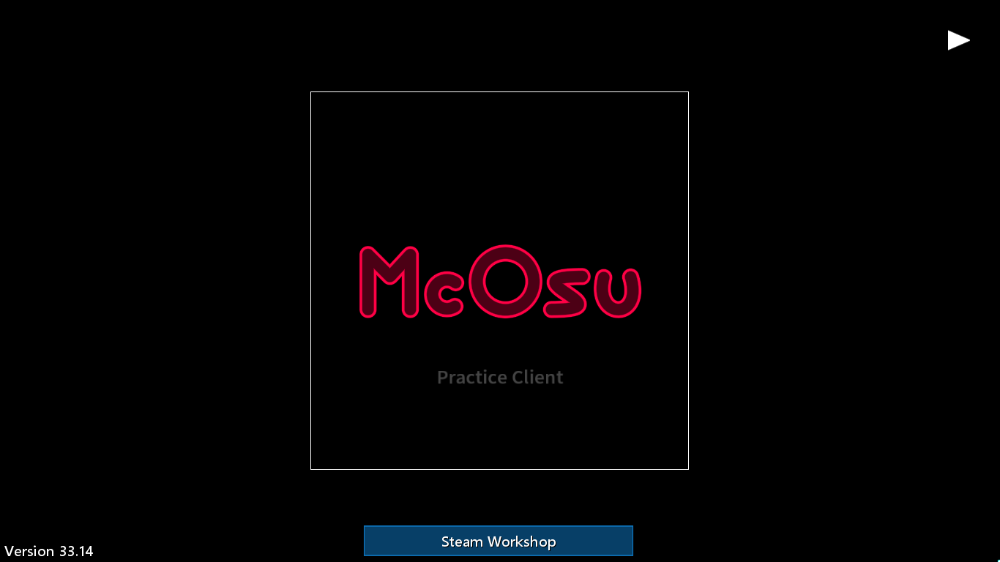

This is a fork of [McOsu][mcosu] that can save replays and is stripped of unnecessary features.

Reallistically, it is only useful for people like me whose computer can't quite handle neither stable nor
neomod and who still want to play Osu and share replays with friends.

### Differences from the original

- [ ] Saves replays
  - [x] Always save the most recent replay as `.osr` *(currently saves all replays under `replays/` folder)*
  - [ ] Save replay in a thread
  - [ ] Add "Save Replay (F2)" label to score screen, Open SaveFileDialog when pressing F2 then show the file in explorer
- [ ] Writes crash reports
  - [ ] Via VEH that dumps stack with source infos
  - [ ] Write debugLog either into console or log file
- [ ] Lazer-like sliders
  - [x] Write shader for slider bodies
  - [ ] Write shader for circles and slider heads
  - [ ] Fix slidergradient.png
- [ ] Less bloat
  - [ ] Remove support for OpenGL, Steam, VR, physics, 3D, discord, multiplayer, OpenCL, vulkan

### Compiling

The original game is supposed to be compiled with GCC and targets multiple platforms.

This fork, however, compiles with Clang/link and targets 32-bit Windows only.

```bat
cmake --preset release
cmake --build --preset release
start "" /b /wait /d bin bin\release\McEngine.exe
tar -acf McOsu-windows-x86.zip -C bin\release *
```

[mcosu]: https://github.com/McKay42/McOsu/tree/db2add20ea291f6f3b6d022fcd4eba100a5bd161
